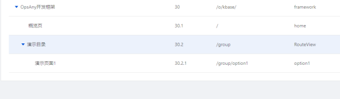
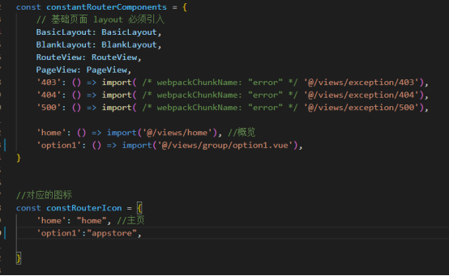

# OpsAny SaaS前端开发框架

本框架为OpsAny标准的SaaS前端开发框架，集成了OpsAny的用户体系、消息通知、菜单权限体系等，开箱即用，可以快速开发SaaS应用。

## 本地开发环境准备

1.安装NodeJS（Linux为例）

```
[root@linux-node1 ~]# cd /usr/local/src
[root@linux-node1 src]# wget https://nodejs.org/dist/v16.15.1/node-v16.15.1-linux-x64.tar.xz
[root@linux-node1 src]# tar xf node-v16.15.1-linux-x64.tar.xz 
[root@linux-node1 src]# mv node-v16.15.1-linux-x64 /usr/local/
[root@linux-node1 src]# ln -s /usr/local/node-v16.15.1-linux-x64/ /usr/local/node
[root@linux-node1 ~]# vim ~/.bash_profile 
PATH=$PATH:$HOME/bin:/usr/local/node/bin
[root@linux-node1 ~]# source ~/.bash_profile 
[root@linux-node1 ~]# node -v
v16.15.1
```

- Mac: https://nodejs.org/dist/v16.15.1/node-v16.15.1.pkg
- Windows:  https://nodejs.org/dist/v16.15.1/node-v16.15.1-x64.msi


2.克隆代码

```
# Gitee
[root@linux-node1 opt]# git clone https://gitee.com/unixhot/opsany-frontend-framework.git

# Giehub
[root@linux-node1 opt]# git clone https://gitee.com/unixhot/opsany-frontend-framework.git
```

3.安装依赖

```
# cd frontend-framework
# npm install
```

4.本地开发环境发布

```
# npm run serve
```

## SaaS开发步骤

### 1.在RBAC上创建菜单
打开RBAC平台的菜单管理页面，找到OpsAny前端开发框架进行菜单的添加。点击平台菜单的新建按钮可以创建一级目录菜单，点击一级菜单的新建按钮可以创建二级菜单。菜单名称为页面上导航栏展示的名称，地址为vue路由对应的地址，菜单code为唯一标识不可重复，排序为菜单管理页面展示的顺序。一级菜单绑定页面的情况如概览页所示，二级菜单绑定页面的情况如演示页面1所示。



注：如果一级菜单下存在二级菜单，则其菜单code必须以RouteView开头(如RouteView1)。

2. 创建vue文件

在前端框架的src/views目录下创建vue文件，例如views目录中group文件夹下的option1.vue。

3. 路由配置

在项目中src/router/generator-routers.js中配置路由。constantRouterComponents对象中配置对应的文件，constRouterIcon对象中配置导航栏图标。
注：如果开发的页面不在导航栏展示，需要配置静态路由，静态路由在src/config/router.config.js中配置。
注：图标从iview的icon中查找，如option1的图标appstore



4. api设置
接口相关文件放在src/api中，框架中已经封装了axios可直接使用。使用方法可参考option1.vue中的updateDirector。本地调试时api的基础地址在src/config/defaultSettings.js文件中修改，baseUrl对应的就是。

### 5.框架结构

```
├── dist // build打包生成文件 
├── public
│   └── logo.png             # 导航栏LOGO
|   └── index.html           # Vue 入口模板
├── src
│   ├── api                  # Api ajax 等
│   ├── assets               # 本地静态资源，可存放图片
│   ├── config               # 项目基础配置，包含静态路由，全局设置
│   ├── components           # 业务通用组件
│   ├── core                 # 项目引导, 全局配置初始化，依赖包引入等
│   ├── router               # Vue-Router配置
│   ├── store                # Vuex
|   ├── theme		     # 主题色配置
│   ├── utils                # 工具库
│   ├── locales              # 国际化资源
│   ├── views                # 业务页面入口和常用模板
│   ├── App.vue              # Vue 模板入口
│   └── main.js              # Vue 入口 JS
│   └── permission.js        # 路由守卫(路由权限控制)
├── README.md
└── package.json
└── babel.config.js //vue配置

## 代码发布

当前OpsAny SaaS开发采用的是前后端分离开发，但是融合部署的方式，前端不需要单独进行部署，将构建后的代码提交到后端工程的static目录下，并替换所有内容，即可完成前端的发布。

```
